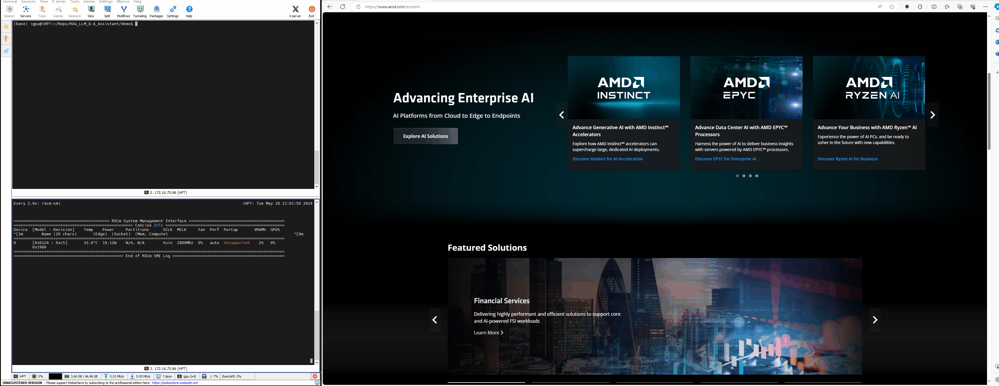

# RAG_LLM_Q-A_Assistant
Demo of Q&amp;A Assistant base on RAG and LLM

```
/RAG_LLM_WithROCm$ tree -L 1
.
├── data //PDF files for RAG indexing
├── demo //RAG chatbot demo with Steamlit GUI
├── labs //RAG labs
├── README.md
├── resources //for markdown
└── Run_Ollama_with_AMD_iGPU780M-QuickStart.md
```

## Quick Start
1. Setup ROCm environment and run LLM with iGPU

  > Refer to Run_Ollama_with_AMD_iGPU780M-QuickStart.md setup the ROCm and Ollama to run the LLM

2. Try RAG in Labs

  > Here are many jupyterlab files to help you setup the RAG pipeline with Ollama+LlamaIndex.
  > 
  > NOTE: You should add PDF file in ./data for RAG indexing

3. Try RAG Chatbot Demo

  > A RAG Chatbot Demo with GUI base on streamlit base on the example in Labs.
  >
  > NOTE: You should add PDF file in ./demo/data for RAG indexing
  >
**Demo Show**
 
